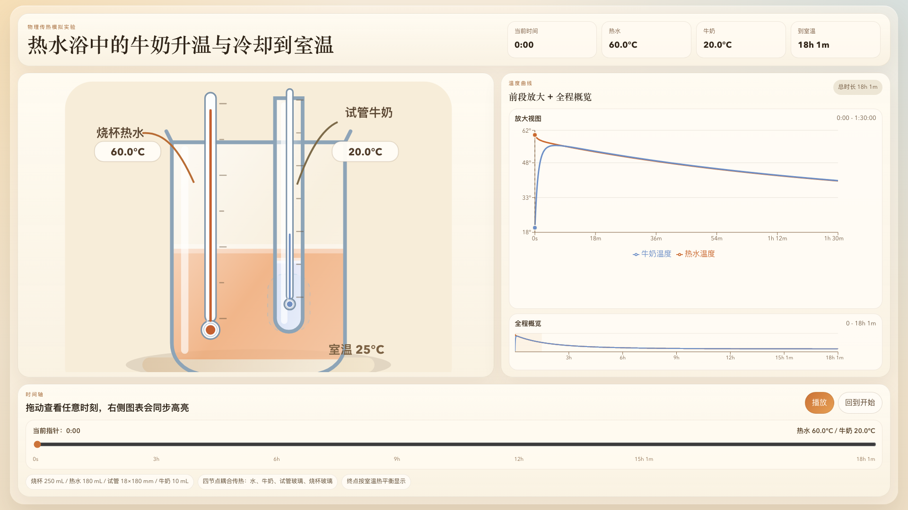

# 热水浴中的试管水热传导模拟

一个基于 React + TypeScript + Vite 的物理实验演示页面，用来模拟下面这个场景：

- 烧杯中有约 `180 mL`、`60°C` 的热水
- 试管中有约 `10 mL`、`20°C` 的水
- 试管放入热水浴中，随后整套系统继续与 `25°C` 室温换热
- 通过时间轴拖动或播放，观察烧杯水和试管水在 `24 小时` 内的温度变化



## 当前特性

- 固定 `16:9` 展示比例，适合投屏或大屏演示
- 左侧为实验场景，右侧为温度曲线
- 曲线只保留单层全程概览，不再显示前段放大视图
- 图表横轴和下方时间轴都固定覆盖 `24 小时`
- 拖动时间轴时，全程概览的右侧边界会跟随当前时间推进
- 时间轴、实验场景、温度读数、折线图全部联动
- 仿真固定运行到 `24 小时`；当系统各节点接近室温后，会吸附到环境温度并保持到结束

## 运行方式

先安装依赖：

```bash
npm install
```

开发环境：

```bash
npm run dev
```

生产构建：

```bash
npm run build
```

本地预览构建结果：

```bash
npm run preview
```

可选校验命令：

```bash
npm run lint
npm run test
```

## Netlify 部署

仓库根目录的 [`netlify.toml`](../netlify.toml) 已经把构建基目录指向 `simulation/`，构建时会使用 Node `22.16.0`、执行 `npm run build`，并发布 `dist/`。

## 物理模型说明

这个项目不是做简单的温度插值，而是使用一个简化但较接近实验条件的集中参数传热模型。

### 1. 四个热节点

模型把系统拆成 4 个节点：

- 烧杯水
- 试管水
- 试管玻璃
- 烧杯玻璃

每个节点都有：

- 初始温度
- 质量
- 比热容

玻璃节点还包含导热系数与壁厚，液体和空气还包含用于自然对流计算的物性参数。

### 2. 传热路径

模型同时考虑以下换热：

- 烧杯水 ↔ 试管玻璃
- 试管水 ↔ 试管玻璃
- 烧杯水 ↔ 烧杯玻璃
- 烧杯水 ↔ 室内空气
- 试管水 ↔ 室内空气
- 试管玻璃 ↔ 室内空气
- 烧杯玻璃 ↔ 室内空气

其中液体和空气侧换热系数使用自然对流相关式估算，玻璃壁通过导热热阻连接。

### 3. 数值计算

- 默认室温：`25°C`
- 默认时间步长：`5 s`
- 最大仿真时长：`24 h`
- 数值积分方法：四阶 Runge-Kutta
- 热平衡判定：四个节点都进入 `±0.05°C` 室温范围内

达到热平衡后，末段会吸附并保持在室温，确保 `24 小时` 结束点清晰稳定。

## 默认实验参数

主要参数定义在 [`src/data/defaultExperiment.ts`](./src/data/defaultExperiment.ts)：

- 烧杯总高度约 `90 mm`
- 烧杯外半径约 `37.15 mm`
- 试管总长度约 `180 mm`
- 试管外半径约 `9 mm`
- 烧杯水体积约 `180 mL`
- 试管水体积约 `10 mL`
- 烧杯水初温 `60°C`
- 试管水初温 `20°C`
- 室温 `25°C`

烧杯水、试管水和空气的热物性参数采用常见工程近似值，适合课堂演示和趋势模拟。如果后续需要和真实实验数据逐点对齐，应继续做实验标定，例如修正对流系数、容器尺寸、液面高度与环境扰动。

## 目录结构

```text
src/
  App.tsx                       页面总布局、时间轴和播放控制
  App.css                       16:9 固定画布与整体视觉布局
  components/
    LaboratoryScene.tsx         烧杯/试管实验场景绘制
    TemperatureChart.tsx        温度折线图与全程概览
  data/
    defaultExperiment.ts        默认实验参数与几何尺寸
  simulation/
    modelTypes.ts               仿真类型定义
    heatModel.ts                传热模型与数值积分
    heatModel.test.ts           传热模型测试
  utils/
    formatters.ts               时间与温度格式化
```

## 演示建议

- 大屏展示时，直接使用浏览器全屏
- 先播放起始阶段，观察试管水快速升温与烧杯水同步降温
- 再拖到后段，观察两条曲线逐步贴近并停留在室温

## 已验证

最近一次本地校验通过了以下命令：

```bash
npm run build
npm run lint
npm run test
```
